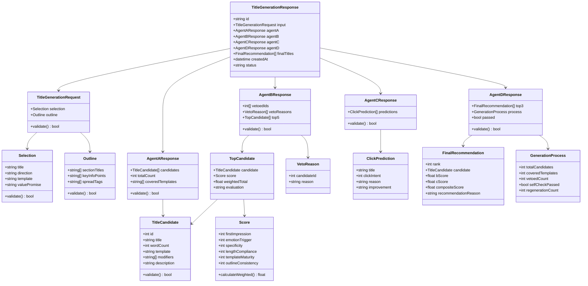
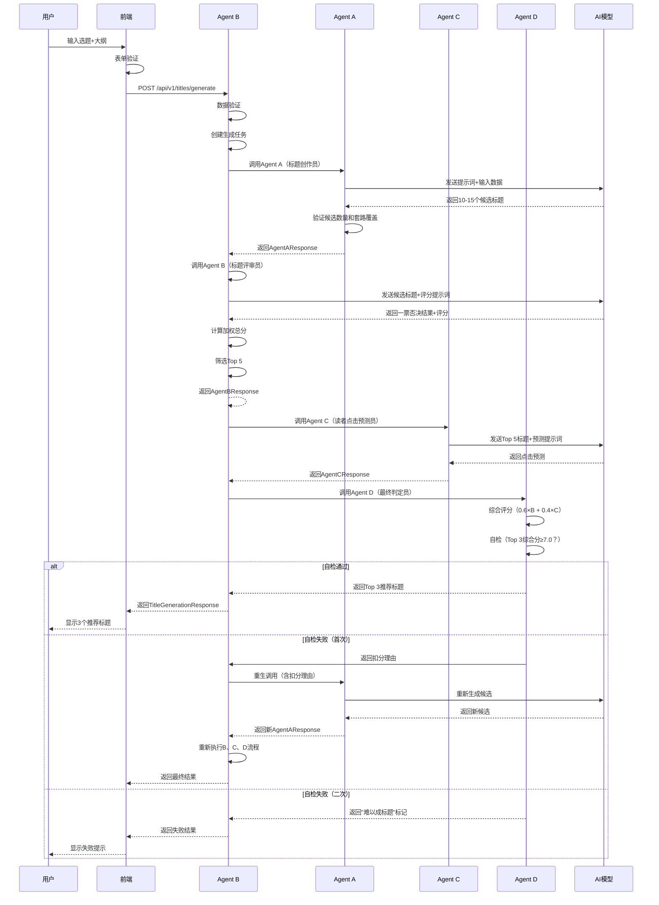
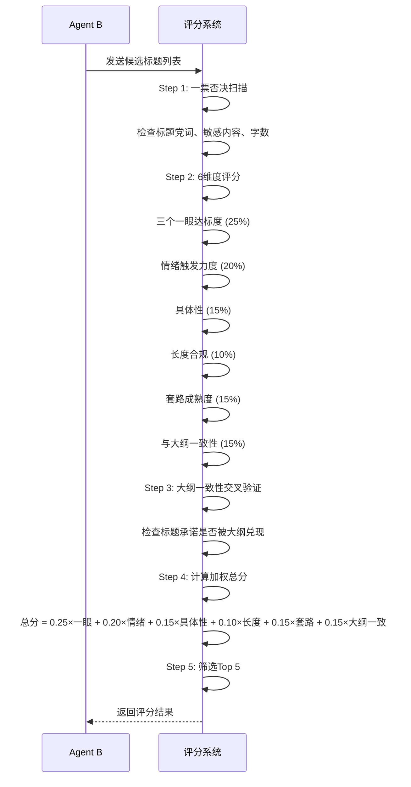
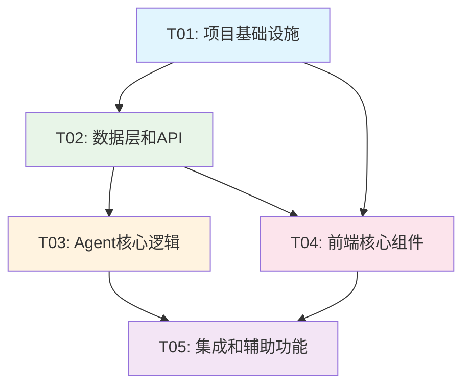

# 标题生成Agent系统 - 架构设计文档

## Part A: 系统设计

### 1. 实现方案

#### 1.1 核心技术挑战
1. **4 Agent协作流程**：需要设计串行调用流程，确保Agent间数据传递正确
2. **AI模型集成**：需要稳定调用Claude/GPT等大语言模型，处理API限流和错误
3. **评分算法实现**：6维度加权评分、综合评分公式、通过门槛判断
4. **标题套路库集成**：12种套路、6类修饰元素、套路与方向匹配表
5. **重生机制**：自检失败后的重试逻辑和异常处理

#### 1.2 框架选型

**前端**：
- **Vite**：快速构建工具，支持HMR
- **React 18**：UI框架，支持Hooks和并发模式
- **MUI 5**：Material Design组件库，提供丰富UI组件
- **Tailwind CSS 3**：实用优先的CSS框架
- **Zustand**：轻量级状态管理，适合React Hooks
- **React Query**：服务端状态管理，处理API调用和缓存

**后端**：
- **Python FastAPI**：高性能异步Web框架
- **Pydantic**：数据验证和序列化
- **httpx**：异步HTTP客户端，调用AI模型API
- **SQLAlchemy**：ORM，用于数据持久化
- **Celery + Redis**：异步任务队列，处理长时间运行的Agent任务

**AI模型**：
- **Claude 3.5 Sonnet**：主要模型，成本约0.15 USD/次
- **OpenAI GPT-4o**：备选模型

#### 1.3 架构模式
- **前端**：MVVM模式（Model-View-ViewModel）
- **后端**：分层架构（API层 → 服务层 → 数据层）
- **Agent协作**：流水线模式（Pipeline Pattern）
- **状态管理**：Flux模式（Zustand实现）

### 2. 文件列表

#### 2.1 前端文件结构
```
frontend/
├── package.json
├── vite.config.js
├── tailwind.config.js
├── postcss.config.js
├── index.html
├── src/
│   ├── main.tsx
│   ├── App.tsx
│   ├── components/
│   │   ├── Layout/
│   │   │   ├── AppLayout.tsx
│   │   │   ├── Sidebar.tsx
│   │   │   └── Header.tsx
│   │   ├── TitleGeneration/
│   │   │   ├── InputPanel.tsx
│   │   │   ├── AgentProgress.tsx
│   │   │   ├── TitleResults.tsx
│   │   │   ├── TitleCard.tsx
│   │   │   └── ProcessHistory.tsx
│   │   └── common/
│   │       ├── LoadingSpinner.tsx
│   │       ├── ErrorBoundary.tsx
│   │       └── ScoreDisplay.tsx
│   ├── pages/
│   │   ├── Dashboard.tsx
│   │   ├── TitleGenerator.tsx
│   │   ├── History.tsx
│   │   └── Settings.tsx
│   ├── hooks/
│   │   ├── useTitleGeneration.ts
│   │   ├── useAgentProgress.ts
│   │   └── useFormValidation.ts
│   ├── stores/
│   │   ├── titleStore.ts
│   │   ├── agentStore.ts
│   │   └── historyStore.ts
│   ├── api/
│   │   ├── titleApi.ts
│   │   ├── agentApi.ts
│   │   └── types.ts
│   ├── utils/
│   │   ├── validation.ts
│   │   ├── scoring.ts
│   │   └── formatting.ts
│   └── styles/
│       ├── globals.css
│       └── components.css
```

#### 2.2 后端文件结构
```
backend/
├── app/
│   ├── __init__.py
│   ├── main.py
│   ├── api/
│   │   ├── __init__.py
│   │   ├── title_generation.py
│   │   └── agents.py
│   ├── core/
│   │   ├── __init__.py
│   │   ├── config.py
│   │   ├── security.py
│   │   └── logging.py
│   ├── models/
│   │   ├── __init__.py
│   │   ├── title.py
│   │   ├── agent.py
│   │   └── history.py
│   ├── schemas/
│   │   ├── __init__.py
│   │   ├── title.py
│   │   └── agent.py
│   ├── services/
│   │   ├── __init__.py
│   │   ├── title_service.py
│   │   ├── agent_service.py
│   │   └── ai_service.py
│   ├── agents/
│   │   ├── __init__.py
│   │   ├── base_agent.py
│   │   ├── creator_agent.py
│   │   ├── reviewer_agent.py
│   │   ├── predictor_agent.py
│   │   └── judge_agent.py
│   ├── utils/
│   │   ├── __init__.py
│   │   ├── title_utils.py
│   │   ├── scoring_utils.py
│   │   └── validation_utils.py
│   └── tasks/
│       ├── __init__.py
│       └── title_tasks.py
├── requirements.txt
├── alembic.ini
└── alembic/
```

### 3. 数据结构和接口

#### 3.1 核心数据模型



#### 3.2 API接口设计

**标题生成API**：
```typescript
// 前端API接口
interface TitleGenerationAPI {
  // 开始标题生成
  generateTitles(request: TitleGenerationRequest): Promise<TitleGenerationResponse>;
  
  // 获取生成进度
  getGenerationProgress(generationId: string): Promise<AgentProgress>;
  
  // 获取历史记录
  getGenerationHistory(page: number, limit: number): Promise<HistoryListResponse>;
  
  // 获取单个历史详情
  getGenerationDetail(generationId: string): Promise<TitleGenerationResponse>;
}
```

**后端API端点**：
```python
# POST /api/v1/titles/generate
# 请求体：TitleGenerationRequest
# 响应体：TitleGenerationResponse

# GET /api/v1/titles/{generation_id}/progress
# 响应体：AgentProgress

# GET /api/v1/titles/history
# 查询参数：page, limit
# 响应体：HistoryListResponse

# GET /api/v1/titles/{generation_id}
# 响应体：TitleGenerationResponse
```

### 4. 程序调用流程

#### 4.1 标题生成主流程



#### 4.2 评分算法流程



### 5. 不明确事项

#### 5.1 技术实现问题
1. **AI模型API密钥管理**：如何安全存储和轮换API密钥？
2. **并发控制**：多个用户同时生成标题时，如何限制并发API调用？
3. **缓存策略**：是否缓存相同输入的生成结果？缓存多久？
4. **错误重试机制**：API调用失败时的具体重试策略（指数退避？最大重试次数？）

#### 5.2 业务规则问题
1. **套路库更新**：如何动态更新标题套路库？需要后台管理界面吗？
2. **评分权重调整**：如何根据真实数据调整评分权重？需要A/B测试吗？
3. **用户反馈收集**：如何收集用户对推荐标题的满意度？

#### 5.3 集成问题
1. **与选题系统集成**：选题数据的具体格式和来源？
2. **与大纲生成集成**：大纲数据的具体格式和来源？
3. **与正文生成集成**：标题选定后如何传递给正文生成系统？

#### 5.4 性能和扩展性
1. **响应时间优化**：4个Agent串行调用可能超过30秒，如何优化？
2. **成本控制**：如何监控和控制AI模型调用成本？
3. **水平扩展**：系统是否需要支持多实例部署？

## Part B: 任务分解

### 6. 依赖包列表

#### 6.1 前端依赖
```json
{
  "dependencies": {
    "react": "^18.2.0",
    "react-dom": "^18.2.0",
    "react-router-dom": "^6.8.0",
    "@mui/material": "^5.14.0",
    "@mui/icons-material": "^5.14.0",
    "@emotion/react": "^11.11.0",
    "@emotion/styled": "^11.11.0",
    "zustand": "^4.4.0",
    "@tanstack/react-query": "^5.0.0",
    "axios": "^1.6.0",
    "react-hook-form": "^7.45.0",
    "zod": "^3.22.0",
    "@hookform/resolvers": "^3.3.0",
    "date-fns": "^2.30.0",
    "recharts": "^2.8.0"
  },
  "devDependencies": {
    "vite": "^5.0.0",
    "@vitejs/plugin-react": "^4.2.0",
    "typescript": "^5.3.0",
    "tailwindcss": "^3.4.0",
    "postcss": "^8.4.0",
    "autoprefixer": "^10.4.0",
    "@types/react": "^18.2.0",
    "@types/react-dom": "^18.2.0",
    "eslint": "^8.50.0",
    "prettier": "^3.0.0"
  }
}
```

#### 6.2 后端依赖
```
fastapi==0.109.0
uvicorn[standard]==0.27.0
pydantic==2.5.0
python-dotenv==1.0.0
httpx==0.26.0
sqlalchemy==2.0.23
alembic==1.13.0
celery[redis]==5.3.6
redis==5.0.0
python-multipart==0.0.6
python-jose[cryptography]==3.3.0
passlib[bcrypt]==1.7.4
```

### 7. 任务列表（按依赖顺序）

#### T01: 项目基础设施搭建
**任务名称**：项目基础设施搭建  
**源文件**：
- `frontend/package.json`
- `frontend/vite.config.js`
- `frontend/tailwind.config.js`
- `frontend/postcss.config.js`
- `frontend/tsconfig.json`
- `frontend/index.html`
- `frontend/src/main.tsx`
- `frontend/src/App.tsx`
- `backend/requirements.txt`
- `backend/app/main.py`
- `backend/app/core/config.py`

**依赖**：无  
**优先级**：P0

**任务内容**：
1. 初始化前端React + Vite项目
2. 配置TypeScript、Tailwind CSS、ESLint、Prettier
3. 配置MUI主题和全局样式
4. 初始化后端FastAPI项目
5. 配置数据库连接和基础模型
6. 配置环境变量和基础安全设置

#### T02: 数据层和API设计
**任务名称**：数据层和API设计  
**源文件**：
- `backend/app/schemas/title.py`
- `backend/app/schemas/agent.py`
- `backend/app/models/title.py`
- `backend/app/models/agent.py`
- `backend/app/api/title_generation.py`
- `frontend/src/api/types.ts`
- `frontend/src/api/titleApi.ts`

**依赖**：T01  
**优先级**：P0

**任务内容**：
1. 定义Pydantic数据模型（TitleGenerationRequest、TitleCandidate等）
2. 设计SQLAlchemy数据库模型
3. 创建FastAPI路由和端点
4. 定义前端TypeScript类型
5. 创建前端API客户端

#### T03: Agent核心逻辑实现
**任务名称**：Agent核心逻辑实现  
**源文件**：
- `backend/app/agents/base_agent.py`
- `backend/app/agents/creator_agent.py`
- `backend/app/agents/reviewer_agent.py`
- `backend/app/agents/predictor_agent.py`
- `backend/app/agents/judge_agent.py`
- `backend/app/services/ai_service.py`
- `backend/app/utils/scoring_utils.py`
- `backend/app/utils/title_utils.py`

**依赖**：T02  
**优先级**：P0

**任务内容**：
1. 实现基础Agent类和提示词框架
2. 实现Agent A（标题创作员）
3. 实现Agent B（标题评审员）
4. 实现Agent C（读者点击预测员）
5. 实现Agent D（最终判定员）
6. 实现AI模型调用服务
7. 实现评分算法和标题工具函数

#### T04: 前端核心组件
**任务名称**：前端核心组件  
**源文件**：
- `frontend/src/components/TitleGeneration/InputPanel.tsx`
- `frontend/src/components/TitleGeneration/AgentProgress.tsx`
- `frontend/src/components/TitleGeneration/TitleResults.tsx`
- `frontend/src/components/TitleGeneration/TitleCard.tsx`
- `frontend/src/pages/TitleGenerator.tsx`
- `frontend/src/hooks/useTitleGeneration.ts`
- `frontend/src/stores/titleStore.ts`

**依赖**：T01, T02  
**优先级**：P0

**任务内容**：
1. 实现标题生成输入表单
2. 实现Agent进度显示组件
3. 实现标题结果展示组件
4. 实现标题卡片组件
5. 实现标题生成页面
6. 创建React Hooks和状态管理

#### T05: 集成和辅助功能
**任务名称**：集成和辅助功能  
**源文件**：
- `frontend/src/pages/Dashboard.tsx`
- `frontend/src/pages/History.tsx`
- `frontend/src/components/Layout/AppLayout.tsx`
- `frontend/src/components/Layout/Sidebar.tsx`
- `frontend/src/components/common/LoadingSpinner.tsx`
- `frontend/src/components/common/ErrorBoundary.tsx`
- `frontend/src/router.js`
- `backend/app/api/history.py`
- `backend/app/services/title_service.py`

**依赖**：T03, T04  
**优先级**：P1

**任务内容**：
1. 实现仪表板页面
2. 实现历史记录页面
3. 实现布局组件
4. 实现通用UI组件
5. 配置前端路由
6. 实现后端历史记录API
7. 集成所有组件，进行最终调试

### 8. 共享知识

#### 8.1 API响应格式
```json
{
  "code": 200,
  "data": {},
  "message": "success"
}
```

#### 8.2 错误处理
```json
{
  "code": 400,
  "data": null,
  "message": "输入数据验证失败"
}
```

#### 8.3 命名规范
- **前端**：camelCase（变量、函数）、PascalCase（组件、类）
- **后端**：snake_case（变量、函数）、PascalCase（类）
- **数据库**：snake_case（表名、字段名）

#### 8.4 代码风格
- **前端**：ESLint + Prettier，遵循Airbnb规范
- **后端**：Black + isort，遵循PEP 8

#### 8.5 状态管理
- **前端**：Zustand用于客户端状态，React Query用于服务端状态
- **后端**：无状态设计，所有状态存储在数据库或Redis中

#### 8.6 安全规范
- 所有API密钥存储在环境变量中
- 敏感数据加密存储
- API请求需要身份验证（JWT）
- 输入数据严格验证

### 9. 任务依赖图



**任务说明**：
- **T01**（基础设施）：所有其他任务的基础
- **T02**（数据层）：定义数据结构和API，T03和T04依赖
- **T03**（Agent逻辑）：核心业务逻辑，依赖T02
- **T04**（前端组件）：前端界面，依赖T01和T02
- **T05**（集成）：最终集成，依赖T03和T04

**关键路径**：T01 → T02 → T03 → T05（约4-5天）
**并行任务**：T03和T04可以并行开发（约2-3天）

## 设计原则

### 简单性
- 避免过度抽象，保持代码直观
- 使用成熟稳定的库，避免实验性技术
- 保持组件职责单一，易于理解和测试

### 模块化
- 前端组件独立，可单独测试
- 后端服务分层，职责清晰
- Agent逻辑独立，易于扩展和修改

### 实用性
- 优先实现核心功能，P2功能后续迭代
- 考虑开发效率，避免过度设计
- 提供清晰的错误信息和用户反馈

### 可测试性
- 组件和服务可独立测试
- 提供Mock数据和测试工具
- 关键逻辑有单元测试覆盖